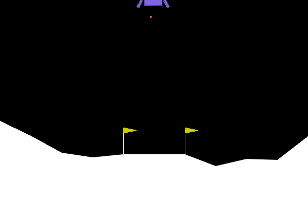

# RL-Suite

*A collection of reinforcememnt learning algorithms, implemented in pyTorch, for training agents in various environemnts. This project is still in development and hopeflly (and, with your help), will continue to do so. The code is written so that it can be deployed on HPCs easily.*

## Overview

<div align="center">



</div>

RL-Suite is a modular collection of reinforcement learning components to train and evaluate agents across various environments. It focuses on clear training workflows, configuration-driven experiments, and reproducible results.  
Various algorithms are implemented in a way that they can be easily copy-pasted to your own projects. All of the implementations are self-contained and do not require any external dependencies, except for pyTorch. Furthermore, the training process is highly configurable, allowing for easy experimentation with different hyperparameters and environments. The training process supports continuation of previous runs, allowing users to pick up training where they left off.  

*Optionally, you can choose to upload the training results to the cloud, where they can be easily visualized and shared with others.*

Currently, following algorithms are supported:

1. DQN (Deep Q-networks)
2. DDQN (Double Deep Q-Network)
2. DDPG (Deep Deterministic Policy Gradient)
4. PPO (Proximal Policy Optimization)

*The code support classic fully connected ANNs as the networks to train*

## The process

To run the training, two files have to be availible and provided by the user:

* *.env*: Contains the necessary auth data for running the app (see .env_EXAMPLE file). The files structure is a follows (If you want to disregard a key, pass "." as its value):
    ```
        session_name = The name of the session (mandatory)
        huggingface_read = The huggingface read key (optional)
        huggingface_write =  The huggingface write key (optional)
        repo_ID = The huggingface repo ID to upload the progress to (optional)
        code_base_link = The link to the github repository to keep everythingupdated with (optional)
        python_venv_path = The command to running apython script (can be `python` or path to a specific python venv)
        telegram_chat_id = The telegram chat ID to send the data to (optional)
        telegram_bot_token = The telegram bot token to send the information from (optional)
    ``` 
    

* *conf.json*: Contains the necessary configuration for the agent and the environment
    ```
    {
        "name": , // Name of the agent
        "algorithm": , // Algorithm name
        "algorithm_options": {}, // Options for the algorithm
        "env": , // Name of the environemnt
        "env_options": {}, // Name of the environemnt
        "network":, // The network type, might vary depending on the algorithm
        "network_options":, // The network options, , might vary depending on the algorithm
        "continue_run": , // If true, tries to continue the latest run
        "agents": , // Number of the agents
        "extra_info": "", // Extra information
        "max_run_time": 12600, // Maximum training time of this bout (in secs)
        "stop_learning_at_win_percent": 80, // Stop updating the network if last 100 episode's win percentage passes this number (optional)
        "train_max_time": 12600,
        "upload_to_cloud": false,
        "local_backup": true,
        "debug": true,
        "stop_condition": {
            "maxEpisodes": 99999999999,
            "maxAvgPoint": 99999999999
        },
        "finished": false
    }
    ```
    
    *Notes regarding configuration keys*:

    - **env**: Name of the agent
        - Could be any name, as long as the suite supports it. 
        - You could also add custom environments. The name of the custom environemnt should be the same as the class name of the environment, located at `./envs/<environmentName>/<environmentName>.py`.

    - **algorithm_options**: Options for the environemnt.
        - If the custom environment accepts any spacial parameters, they should be added here. Each key's name is the same as the argument name, and the value is the argument value.
        - Optionally, if observations are to be normalized before being passed to the network, add the key `normalizeObservations: true` to the algorithm_options. If no key is added, the observations will not be normalized.
        - If you add the key `noramlizationFunction: <functionName>` to the algorithm_options, the observations will be normalized using the function `<functionName>`. If no functions are added, no normalization will take place. Bear in mind that `functionName` should either be supported by the suit, if not (and if you are using a custom environment), it should be a method of the environment class.


It is important to know how the training process works, so the user (YOU) can understand the output and the behavior of the agent. The training process is done by running the `run.py` file with the desired configuration. The configuration can be passed in two ways:
* As a JSON file. This is the default way of passing the configuration. A json file named `conf.json` should be placed in the root directory (Check */confExamples* directory for examples of suitable configuration for each algorithm). 
* As command line arguments. This overrides the default (which is reading the `conf.json` file), and is done by passing the flag `--forceconfig` followed by `--config <JSON string>` flag. The `<JSON string>` should be an escaped stringified json object.  

Depending on the algorithm chosen, `run.py` will run the `train_<AlgorithmName>.py` file iteratively. Meaning that after training for *max_run_time* (Mandatory key in conf.json) seconds, the run will be stopped and the next training bout will be started. This has been implemented to meet the *free* training period in some HPC providers (e.g. lightningAI only supports 3hrs of free training before starting to incurr fees). The `train_<AlgorithmName>.py` script will in turn, run the necessary method for training in `<AlgorithmName>.py` file.   

As stated earlier, the app supports *Picking Up Where You Left Off*, so where does the training start from? To clarify on this, you have to know that initiating of each **training run** will result in creation of a directory called *runs_data* (If doesn't exist). This directory contains folders named with number of the run. Then the `train_<AlgorithmName>.py` script will check to see if `continue_run` key in the passed config is true. If it false, a new directory with a new run number will be created (If latest run number is 45, directory 46 will be created inside `/runs_data` directory) If `continue_run` is true, the app will try to continue the latest run by loading all the necessary files from the `*.pth` file inside the run's directory; however, if the app notices that the configuration has changed, a new run will be forced. It is noteworthy that if *run.py* is ran with `--forcenewrun` flag, a new run will be forced, disregarding the `continue_run`'s value.

If `code_base_link` is provided in the `.env` file, befor doing anything, the app will update itself to the latest update of the provided repo, by downloading the files. TO have more control thowrds this behaviour, you can use `--skipupdate` flag when running `run.py` to not update the local repo, despite `code_base_link`'s existance. On the other hand, pass `--onlyupdate` flag to only update the repo and not start the training process.  

This was all about starting the training process, but when will the training stop? The training will stop when one of the conditions below are met:

* The agent reaches the max episode number in `stop_condition.maxEpisodes`
* The average of the last 100 episode's points surpassess `stop_condition.maxAvgPoint`
* The training time has passed `max_run_time` (in seconds)

## How to use

1. Clone the repository
2. Install the required dependencies
    ```
    pip install swig gymnasium[box2d] imageio huggingface_hub
    ```
3. Run the *run.py* script with the desired configuration with desired flags. 

## TODOs

1. Add support for multiple environments
2. Add support for custom environments
3. Add support for multiple agents
4. Add support for costumization of the networks
5. Add support for environmnets with continuous action spaces
6. Add a section in the readme indicatig the supported: `environemnt`, `environemnt_options.noramlizationFunction`